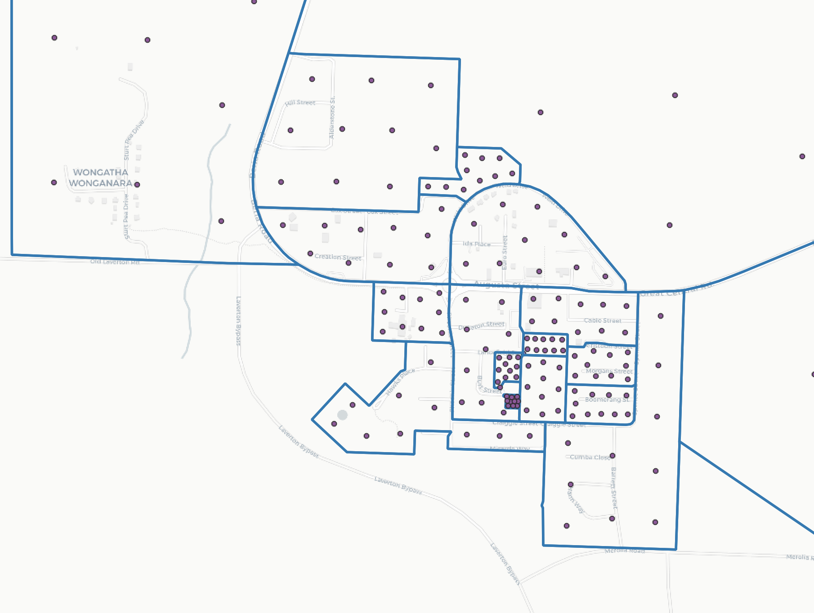

A pure SQL approach to generating a weighted population grid following the material provided by the Australian Bureau of Statistics.

# Requirements

-   [ABS Meshblock Geographic Boundaries](<https://www.abs.gov.au/ausstats/abs@.nsf/Lookup/by%20Subject/1270.0.55.001~July%202016~Main%20Features~Mesh%20Blocks%20(MB)~10012>)
-   [ABS Meshblock Counts](https://www.abs.gov.au/ausstats/abs@.nsf/mf/2074.0)
-   PostgreSQL 11+ and PostGIS 2.5+

# Instructions

1. Initialise a new database with PostGIS
2. Load meshblock geographic boundaries into the database via QGIS, ogr2ogr, et cetera
3. Load meshblock population counts CSV into the database via QGIS, ogr2ogr, et cetera
4. Run `init.sql` to create a single meshblock table we'll use to create our grid from
5. Run `create-grid.sql` to create the weighted population grid (that may take 6+ hours depending on your hardware)
6. Load up your new `meshblock_2016_population_grid` table in your favourite GIS software

# Credits

The ABS for being open and super helpful about their approach to generating correspondence files.

Paul Ramsey for his [PostGIS Polygon Splitting](http://blog.cleverelephant.ca/2018/06/polygon-splitting.html) blog post that forms the foundation for this approach.
